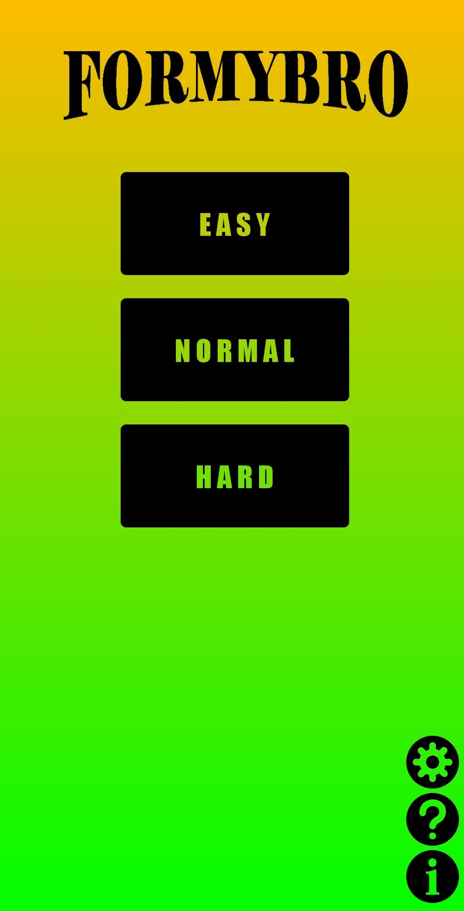
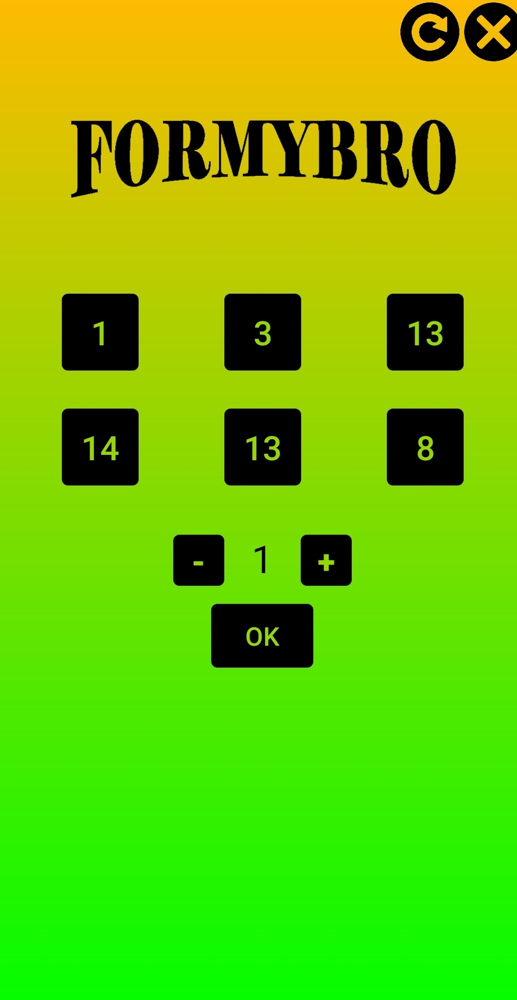

# ForMyBro
It's a game for Android.

Download: https://play.google.com/store/apps/details?id=com.pumpkin.formybro&hl=ru

## Rules
This game is designed for two players: you and computer.

Piles of stones lie in front of the players. Players take turns.
In one move, you can take any remaining number of stones, but only from one pile.
The one who has nothing to take loses.

Black squares represent heaps, and the numbers on them represent the number of stones in each heap.
To select a pile, click on the corresponding square. It will highlighted in pink.

The number below indicates the number of stones you want to take.
You can change this value by pressing the plus and minus buttons or by pressing a number and entering the desired value.
Press the OK button to make the move. After that, the turn will go to the computer, its moves are highlighted in blue

The game has three difficulty levels.
        
You can also adjust the number of piles and the maximum number of stones in each pile in the settings menu.

